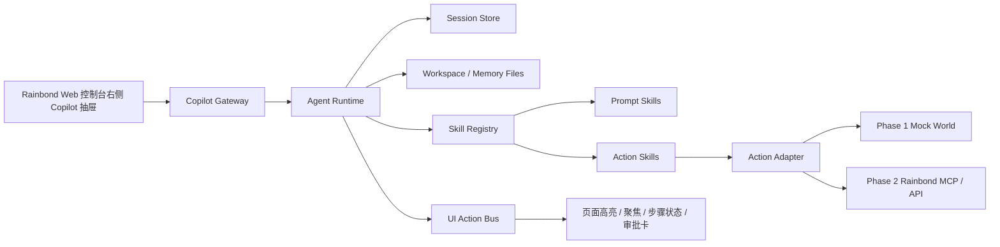
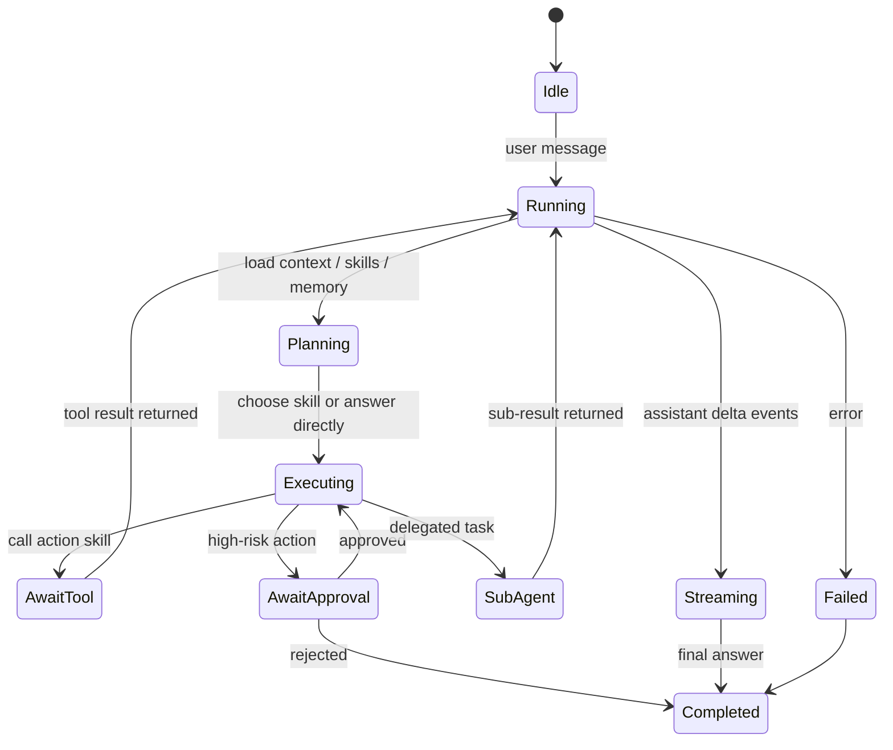
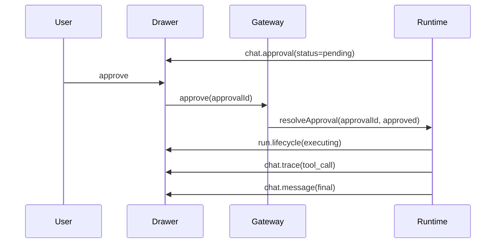

# Rainbond Copilot Design

## Goal
基于右侧抽屉交互原型，设计一套分阶段落地的 Rainbond Copilot 方案。第一阶段先实现不依赖真实 Rainbond 的 OpenClaw 风格 agent runtime 和可扩展 skill 体系；第二阶段再接入 Rainbond 的真实 skills、MCP 和页面联动。

## Scope

### Phase 1
- 右侧抽屉式 Copilot UI
- OpenClaw 风格 agent runtime
- 混合 skill 系统：`SKILL.md` + 代码插件
- 工具调用 trace
- 分级审批
- 子任务 / 子 agent
- 会话、记忆、workspace 文件
- Mock action adapter
- UI action 事件和高亮联动

### Phase 2
- Rainbond 真实页面上下文注入
- Rainbond MCP / API adapter
- 真实资源状态、日志、变更动作
- 更细粒度的页面高亮和状态反馈

## Non-Goals
- Phase 1 不直接接入真实 Rainbond 后端
- Phase 1 不实现复杂队列 steering、provider failover、时间旅行恢复
- Phase 1 不做字段级 DOM 理解

## Confirmed Decisions
- 集成入口是 Rainbond Web 控制台右侧抽屉
- 第一阶段目标是“标准内核”，不是最小版，也不是完整平台版
- 架构选择 `Hybrid Runtime`
- Rainbond 动作对 agent 暴露为统一 skill，底层支持 `Prompt Skill` 与 `Action Skill`
- 审批采用分级策略：高风险审批，低风险自动执行
- 第一阶段即引入显式 workspace 文件层

## System Architecture



## Component Responsibilities

### UI Drawer
- 渲染消息、tool trace、审批卡、步骤状态
- 消费 Gateway 下发的归一化事件
- 不直接做业务判断

### Copilot Gateway
- 接收用户消息
- 建立 SSE / WebSocket 事件流
- 接收审批结果
- 把 runtime 内部事件翻译为前端协议

### Agent Runtime
- 运行 agentic loop
- 维护 run lifecycle
- 选择 skill
- 执行动作或触发审批
- 产出流式文本和过程事件

### Session Store
- 维护 session state
- 记录 transcript.jsonl
- 记录 task、approval、ui-state
- 支持恢复中断 run

### Workspace / Memory Files
- 保存 `AGENTS.md`、`RAINBOND.md`、`USER.md`
- 保存结构化 memory
- 保存 session scratchpad 和运行工件

### Skill Registry
- 扫描并装载 `SKILL.md`
- 注册代码插件 skill
- 统一输出 skill 描述

### UI Action Bus
- 把 runtime 的结构化意图变成 `ui.effect`
- 支持 `highlight_node`、`clear_highlight`、`focus_panel`、`show_step`

### Action Adapter
- Phase 1 调 mock world
- Phase 2 切换到 Rainbond MCP / API

## Event Model

Runtime 内部事件：

```ts
type CopilotEvent =
  | { type: "message.user"; messageId: string; content: string }
  | { type: "message.assistant.delta"; runId: string; text: string }
  | { type: "message.assistant.final"; runId: string; content: string }
  | { type: "skill.selected"; runId: string; skill: string; reason?: string }
  | { type: "tool.call"; runId: string; tool: string; args: unknown }
  | { type: "tool.result"; runId: string; tool: string; ok: boolean; data: unknown }
  | { type: "task.created"; runId: string; taskId: string; title: string }
  | { type: "subagent.started"; runId: string; agentId: string; goal: string }
  | { type: "subagent.finished"; runId: string; agentId: string; result: string }
  | { type: "approval.requested"; runId: string; approvalId: string; title: string; risk: "low" | "medium" | "high"; payload: unknown }
  | { type: "approval.resolved"; runId: string; approvalId: string; decision: "approved" | "rejected" }
  | { type: "ui.action"; runId: string; action: "highlight_node" | "clear_highlight" | "focus_panel" | "show_step"; payload: unknown }
  | { type: "run.status"; runId: string; status: "thinking" | "waiting_approval" | "executing" | "completed" | "failed" }
  | { type: "run.error"; runId: string; error: string };
```

Gateway 对前端暴露的事件：

```ts
type DrawerEvent =
  | { type: "chat.message"; role: "user" | "assistant"; mode: "delta" | "final"; runId: string; content: string }
  | { type: "chat.trace"; runId: string; traceType: "tool_call" | "tool_result" | "task" | "subagent"; label: string; detail?: unknown; status?: "pending" | "running" | "done" | "failed" }
  | { type: "chat.approval"; runId: string; approvalId: string; title: string; summary: string; risk: "low" | "medium" | "high"; status: "pending" | "approved" | "rejected"; payload?: unknown }
  | { type: "ui.effect"; runId: string; effect: "highlight_node" | "clear_highlight" | "focus_panel" | "show_step"; payload: unknown }
  | { type: "run.lifecycle"; runId: string; status: "thinking" | "executing" | "waiting_approval" | "completed" | "failed"; message?: string };
```

## Agent Loop State Machine



## Skill System

### Unified Skill Interface

```ts
type SkillDescriptor = {
  id: string;
  name: string;
  kind: "prompt" | "action";
  description: string;
  tags?: string[];
  risk?: "low" | "medium" | "high";
  requiresApproval?: boolean;
  inputSchema?: unknown;
  outputSchema?: unknown;
  promptSource?: { type: "markdown"; path: string };
  executor?: { type: "code"; run: (input: unknown, ctx: SkillContext) => Promise<SkillResult> };
};
```

### Prompt Skills
- 使用 `SKILL.md`
- 承载 Rainbond 领域知识、诊断 SOP、回答风格
- 作为 prompt 上下文注入 runtime

### Action Skills
- 使用代码插件
- 封装动作 schema、风险等级和执行器
- 通过 Action Adapter 调 mock world 或 Rainbond MCP/API

### Approval Policy
- `low`: 默认自动执行
- `medium` / `high`: runtime 先发 `approval.requested`
- 审批状态进入 transcript 和 approvals store

## Session, Memory, and Workspace Model

### Session State

```ts
type SessionState = {
  sessionId: string;
  title: string;
  createdAt: string;
  updatedAt: string;
  currentGoal?: string;
  currentPage?: string;
  currentResource?: { type: string; id: string; name: string };
  transcriptIds: string[];
  openTasks: string[];
  pendingApprovals: string[];
  activeRunId?: string;
};
```

### Transcript

```ts
type TranscriptEntry = {
  id: string;
  sessionId: string;
  runId: string;
  ts: string;
  event: CopilotEvent;
};
```

### Workspace Layout

```text
workspace/
  AGENTS.md
  RAINBOND.md
  USER.md
  MEMORY.json
  sessions/
    <sessionId>/
      transcript.jsonl
      tasks.json
      scratchpad.md
      approvals.json
      ui-state.json
```

### Context Assembly Order
1. system prompt
2. `AGENTS.md`
3. selected prompt skills
4. relevant `RAINBOND.md` fragments
5. `USER.md`
6. session summary
7. recent transcript summary
8. tasks / approvals / ui-state
9. user message

## UI Integration

### Drawer Rendering
- `chat.message` -> 消息气泡
- `chat.trace` -> 工具调用 / 子任务过程
- `chat.approval` -> 审批卡片
- `ui.effect` -> 左侧页面高亮和步骤反馈
- `run.lifecycle` -> thinking / executing / waiting 状态

### Approval Flow



## Phase 1 Acceptance Criteria
- 用户可以在右侧抽屉持续对话
- Agent 能根据 Rainbond 领域 skills 做解释和诊断
- Action skill 可以调 mock action，并在聊天区展示 trace
- 高风险动作会触发审批卡
- 用户审批后 runtime 可以恢复执行
- 页面可以响应 `ui.effect` 做高亮或步骤反馈

## Phase 2 Evolution
- `action-adapter/mock` 替换为 `action-adapter/rainbond`
- 增加 `page-context.json` 和资源缓存
- 扩展 Rainbond action skills
- UI effect 目标从 mock 节点切换到真实页面对象
- runtime、gateway、drawer 和 skill registry 不需要推倒重写

## Recommended File Layout

```text
src/
  gateway/
  runtime/
  session/
  workspace/
  skills/
    prompt/
    actions/
  adapters/
    mock/
    rainbond/
  ui-events/
  shared/
```

## Risks
- 如果不把审批状态纳入 runtime，后面很难做恢复和审计
- 如果直接让前端拼接流程，第二阶段对接 Rainbond 会返工
- 如果 action skill 直接耦合真实 API，第一阶段会失去快速验证能力

## Next Step
基于本设计文档，按实现计划先完成 Phase 1 的标准内核，再接入第二阶段的 Rainbond skills 和 MCP。
