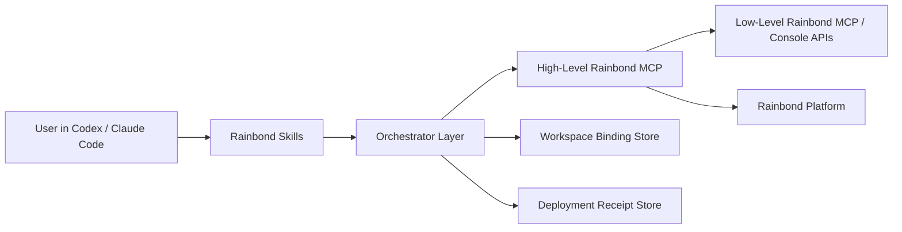

# Rainbond MCP + Skill 实现类 Vercel Agent 体验设计与实施方案

## 1. 目标定义

目标不是让 Rainbond 变成 Vercel，而是让用户在 Codex / Claude Code 中获得接近 Vercel 的“顺滑部署和管理体验”：

- 一句话完成部署
- 自动拿到可访问地址
- 自动获得构建/运行状态
- 自动定位失败原因
- 能安全地 promote / rollback
- 不需要用户每次手动指定一堆 Rainbond 底层参数

这套体验建议通过：

- **Rainbond MCP** 负责平台能力暴露
- **Skill** 负责工作流抽象、策略、上下文绑定、错误恢复和输出组织

## 2. 总体原则

### 原则 1：MCP 做“能力”，Skill 做“工作流”

不要把 Skill 当成 MCP 的简单文本包装，也不要让 MCP 直接承载全部用户体验。

推荐分工：

- MCP：面向 agent 的可调用平台动作
- Skill：面向用户意图的多步编排与决策

### 原则 2：优先高层原语，少暴露底层细节

如果用户说“部署这个项目”，agent 不应该显式暴露：

- 创建 `event_id`
- 上传 `packageTarFile`
- 调 `package_build`
- 再检测
- 再 build

这些应该被 Skill 或高层 MCP 隐藏。

### 原则 3：所有关键动作都要有稳定结构化输出

每个关键阶段都要输出统一 schema：

- 当前绑定到哪个 team / region / app
- 本次 deployment id 是什么
- preview URL 是什么
- 当前状态是什么
- 如果失败，失败原因是什么
- 建议下一步动作是什么

## 3. 推荐架构



### 3.1 层次说明

#### Layer A: Low-Level Rainbond MCP

基于当前已有 MCP 能力保留底层动作，例如：

- create app
- create component from image/source/package
- build component
- get component summary/logs
- manage envs/ports/storage
- operate app

这一层主要给高层编排用，不建议直接作为最终用户主入口。

#### Layer B: High-Level Rainbond MCP

新增一组面向部署工作流的 MCP 工具，用更稳定的输入输出模型聚合底层动作。

#### Layer C: Skill Layer

Skill 不直接关心每个底层 API，而是根据用户意图调用高层原语：

- “部署项目”
- “看看这个部署成没成功”
- “把这个版本发到正式环境”
- “回滚”
- “看为什么失败”

#### Layer D: Binding & Receipt

需要一个轻量上下文层：

- 当前工作区绑定到哪个 Rainbond project/app/environment
- 最近一次 deployment receipt
- 历史 deployment 列表

建议先用文件存储，后续再升级到服务端状态。

## 4. MCP 设计

## 4.1 保留的底层 MCP

继续保留当前已存在的工具，但主要面向内部编排：

- `rainbond_create_app`
- `rainbond_create_component_from_source`
- `rainbond_create_component_from_image`
- `rainbond_create_component_from_package`
- `rainbond_build_component`
- `rainbond_get_component_summary`
- `rainbond_get_component_logs`
- `rainbond_manage_component_envs`
- `rainbond_manage_component_ports`
- `rainbond_vertical_scale_component`
- `rainbond_delete_component`
- `rainbond_delete_app`

## 4.2 新增的高层 MCP

这是核心。

### 1. `rainbond_link_workspace`

作用：

- 绑定当前工作区到 team / region / app / environment

输入：

```json
{
  "workspace_path": "/abs/path/project",
  "team_name": "yirlz5nj",
  "region_name": "rainbond",
  "app_name": "my-app",
  "environment": "preview"
}
```

输出：

```json
{
  "binding_id": "rb_bind_123",
  "team_name": "yirlz5nj",
  "region_name": "rainbond",
  "app_id": 73,
  "app_name": "my-app",
  "environment": "preview"
}
```

### 2. `rainbond_detect_deploy_strategy`

作用：

- 自动判断当前项目适合源码部署、镜像部署、软件包部署还是 YAML/Helm 部署

输出：

```json
{
  "strategy": "package",
  "confidence": 0.92,
  "reason": "workspace contains package artifact suitable for package build",
  "required_artifacts": ["dist/", "package.json"]
}
```

### 3. `rainbond_deploy_workspace`

作用：

- 一次性完成从工作区到 preview deployment 的完整工作流

内部可展开为：

- 检测部署策略
- 创建 app（如不存在）
- 上传/构建/部署
- 等待结果
- 产出 receipt

输出：

```json
{
  "deployment_id": "rb_dep_456",
  "binding_id": "rb_bind_123",
  "strategy": "package",
  "status": "ready",
  "preview_url": "https://preview.example.com",
  "build_event_id": "evt_xxx",
  "service_id": "svc_xxx",
  "app_id": 73
}
```

### 4. `rainbond_get_latest_deployment`

作用：

- 返回最近一次 deployment 的状态和地址

### 5. `rainbond_verify_deployment`

作用：

- 对某次 deployment 做健康检查

输出：

```json
{
  "deployment_id": "rb_dep_456",
  "status": "healthy",
  "checks": [
    { "name": "http_200", "status": "pass" },
    { "name": "content_match", "status": "pass" }
  ]
}
```

### 6. `rainbond_get_deployment_logs`

作用：

- 统一获取 build / runtime / event logs

### 7. `rainbond_explain_deployment_failure`

作用：

- 聚合 event log、build log、resource check，产出失败摘要

输出：

```json
{
  "failure_type": "insufficient_cpu",
  "summary": "Deployment could not be scheduled due to insufficient CPU.",
  "suggested_actions": [
    "Reduce CPU from 500m to 100m",
    "Retry deployment",
    "Ask admin to expand cluster capacity"
  ]
}
```

### 8. `rainbond_promote_deployment`

作用：

- 将 preview 版本切到 production

### 9. `rainbond_rollback_deployment`

作用：

- 回滚到历史 deployment

## 5. Skill 设计

Skill 不建议按“一个工具一个 skill”做，而要按“用户目标”做。

## 5.1 推荐 Skill 集合

### Skill A: `rainbond-deploy`

适用：

- “部署这个项目到 Rainbond”
- “帮我发布一个预览环境”

职责：

- 读取 workspace 绑定
- 若未绑定则引导/自动绑定
- 检测 deploy strategy
- 调 `rainbond_deploy_workspace`
- 输出 preview URL 和状态摘要

### Skill B: `rainbond-verify-deploy`

适用：

- “这个部署成功了吗？”
- “帮我检查刚才那个版本”

职责：

- 调 `rainbond_get_latest_deployment`
- 调 `rainbond_verify_deployment`
- 必要时调 `rainbond_get_deployment_logs`

### Skill C: `rainbond-release`

适用：

- “把这个预览版本发正式”

职责：

- 找到最近一次 healthy preview deployment
- 生成风险摘要
- 审批
- 调 `rainbond_promote_deployment`

### Skill D: `rainbond-rollback`

适用：

- “回滚到上一个版本”
- “恢复昨天那个稳定版本”

职责：

- 查询历史 deployment
- 让 agent 选目标
- 审批
- 调 `rainbond_rollback_deployment`

### Skill E: `rainbond-deploy-debug`

适用：

- “为什么部署失败？”
- “帮我修这个部署问题”

职责：

- 调 `rainbond_explain_deployment_failure`
- 必要时联动底层工具：
  - env
  - ports
  - scale
  - logs

## 5.2 Skill 输出格式建议

每个 skill 最终都应按固定结构组织回答：

1. 当前动作结果
2. 当前 deployment/app/component 标识
3. 访问地址
4. 风险或失败原因
5. 下一步建议

## 6. 数据模型

## 6.1 Workspace Binding

建议文件：

`./.rainbond-agent/binding.json`

示例：

```json
{
  "workspace_path": "/Users/liufan/Code/demo",
  "team_name": "yirlz5nj",
  "region_name": "rainbond",
  "app_id": 73,
  "app_name": "demo-app",
  "environment": "preview"
}
```

## 6.2 Deployment Receipt

建议文件：

`./.rainbond-agent/deployments/latest.json`

示例：

```json
{
  "deployment_id": "rb_dep_456",
  "app_id": 73,
  "service_id": "svc_xxx",
  "preview_url": "https://preview.example.com",
  "status": "ready",
  "created_at": "2026-03-26T18:00:00+08:00"
}
```

## 7. 用户体验设计

## 7.1 最小闭环

用户说：

`部署这个项目到 Rainbond`

系统行为：

1. 检查 binding
2. 如果未绑定，提示绑定或自动绑定
3. 自动检测部署策略
4. 发起 preview deployment
5. 返回：
   - 预览地址
   - 当前状态
   - 检测到的框架
   - 下一步建议

## 7.2 安全闭环

用户说：

`发布到正式环境`

系统行为：

1. 查最近一次 healthy preview
2. 输出差异摘要
3. 请求审批
4. promote
5. 返回生产地址

## 7.3 失败闭环

用户说：

`为什么失败`

系统行为：

1. 获取失败 deployment
2. 总结失败类型
3. 输出建议动作
4. 如果是低风险自动修复，则继续执行
5. 如果是高风险，审批

## 8. 分阶段实施计划

## Phase 0：修底座

### 必做

- 修 MCP streamable HTTP session 稳定性
- 所有高层部署动作保证结构化返回
- 修垂直缩容接口 bug
- 对资源不足、镜像拉取失败、构建失败做统一错误码

### 验收

- 标准 MCP 客户端可以稳定调用
- agent 无需特殊兼容逻辑

## Phase 1：最小可用闭环

### 实现内容

- `rainbond_link_workspace`
- `rainbond_detect_deploy_strategy`
- `rainbond_deploy_workspace`
- `rainbond_get_latest_deployment`
- `rainbond_verify_deployment`
- `rainbond_get_deployment_logs`
- Skill:
  - `rainbond-deploy`
  - `rainbond-verify-deploy`
  - `rainbond-deploy-debug`

### 用户价值

- 在 Codex / Claude Code 中一句话完成 preview deployment

## Phase 2：生产发布闭环

### 实现内容

- `rainbond_promote_deployment`
- `rainbond_rollback_deployment`
- `rainbond_manage_project_env`
- `rainbond_manage_project_domain`
- Skill:
  - `rainbond-release`
  - `rainbond-rollback`

### 用户价值

- 真正可用于上线和回滚

## Phase 3：高级增强

### 实现内容

- `rainbond_preflight_resources`
- `rainbond_diff_deployments`
- `rainbond_open_console_target`
- 自动建议修复动作
- branch/commit 维度 preview 命名模型

### 用户价值

- 比 Vercel 更适合 Rainbond 的多团队、多集群、多组件发布场景

## 9. 研发拆分建议

### 后端 / MCP

- 修会话
- 做高层 deployment workflow MCP
- 做统一 deployment receipt schema

### Console / Platform

- 把 package upload / build / detect / deploy 收口为明确工作流接口
- 暴露更稳定的 deployment object
- 暴露 promote / rollback / domain switch

### Skill / Agent

- 维护 workspace binding
- 实现部署、验证、发布、回滚 skill
- 统一输出格式与审批策略

## 10. 推荐落地顺序

最推荐顺序是：

1. **先修 MCP 协议稳定性**
2. **再做 `deploy_workspace` 高层原语**
3. **再做 `verify + logs + failure explain`**
4. **最后做 promote / rollback**

不要反过来先做很多 skill。

因为如果底层工作流和结构化输出不稳定，skill 只会变成一层脆弱的 prompt glue。

## 11. 最终建议

明确建议采用：

- **MCP 负责平台高层原语**
- **Skill 负责用户意图编排**
- **文件 binding/receipt 负责 workspace 上下文**

一句话总结就是：

> 不要让 Skill 去拼 Rainbond 底层 API，也不要让 MCP 直接承担完整用户体验。  
> 正确做法是在两者之间增加一层“高层 deployment workflow MCP”，再由 Skill 去编排。
